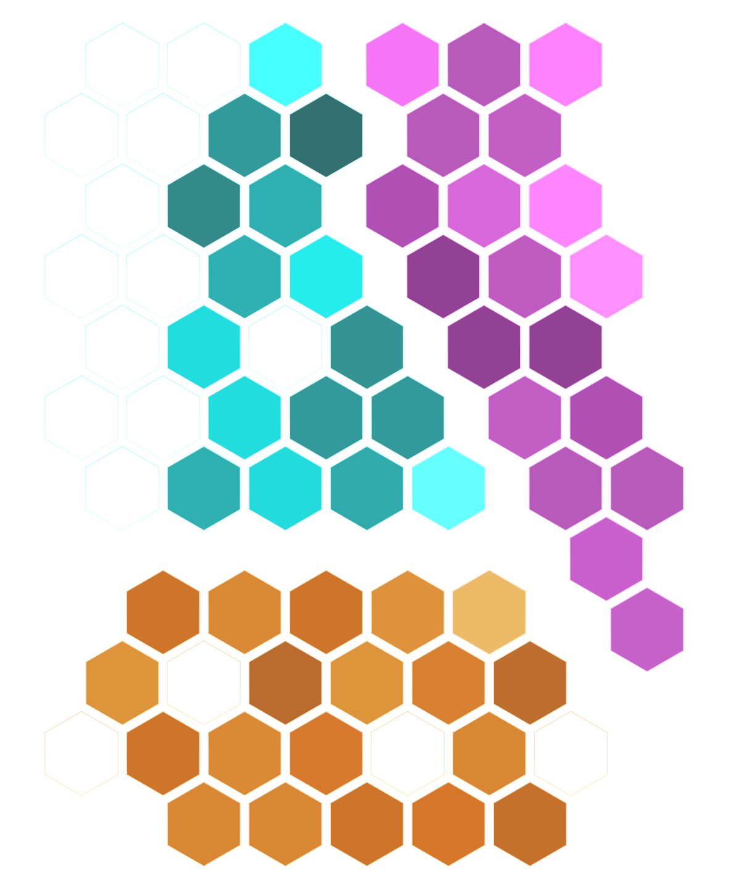
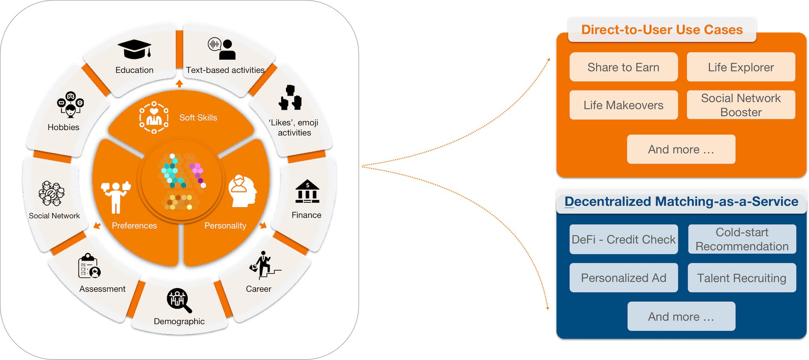

# Digital Self

## What is a Digital Self?

A Digital Self is the core component of the Parmeus ecosystem. It is linked to a web3 wallet address, and is similar to an account (with a username and password) in web2. In the Parmeus network, a Digital Self is an individually created, nurtured, online identity that is owned and shared by the user. 
In the Parmeus ecosystem, each Digital Self is connected with a human being in the real world, with different traits, preferences, and life experiences. Users can play mini-games, simulate their own life experiences, and share personal preferences. Every decision, every shared experience, and every action you take in Parmeus will be securely processed by Parmeus' powerful machine learning.

But the true power of the Digital Self lies in its ability to connect with others and build social capital within the Parmeus network. Each user’s Digital Self develops to reflect their digital behavior, as well as their interactions with other Digital Selves. Through social interaction and online gameplay users can build connections and establish relationships with others, creating valuable networks of like-minded individuals.

Each Digital Self is connected to a unique identifier and non-transferable NFT called a [Soulbound Token](https://parmeus.github.io/docs/#/concept/soulbound-token). Soulbound tokens are collected by the Digital Self to represent achievements, characteristics, traits and unique information. All information related to a Digital Self will be stored anonymously using secure and robust decentralized storage using InterPlanetary File System (IPFS).

## What makes a Digital Self?

A Digital Self in web3 is a more complete and personalized representation of a person's identity and interests, with the added benefits of ownership, privacy and control for users over their data. It allows for the formation of social connections and the building of social capital in a decentralized and secure manner.

Parmeus adds two unique representations to Digital Selves: Profile Gems and Life Data. We are planning to introduce other components in the future.

### Profile Gem

Our team of behavioral scientists have decades of experience researching and measuring individual differences, traits and performance. They have designed a model which can efficiently assess a person's performance in more than 70 dimensions through different methods, channels, and data sources. By reflecting their personality traits, soft skills and preferences, we can provide the user with connections that share similar traits, skills and preferences.

A Profile Gem is the visual representation of the underlying trait calculation. There are two key metrics represented by the Profile Gems:

- Clarity represents the underlying stability of a trait. Higher clarity represented more stable or consistent performance
- Brightness represents the strength of the underlying trait or attribute. Brighter gems represent higher, or better, performance

With the gradual enrichment of the Parmeus ecosystem, we will implement more underlying capabilities for the Digital Self. Every underlying capability is the user's own wealth, just like a gem. 

That’s why the full Digital Self is displayed for users like a case of gemstones.

### Life Data

A Digital Self takes time to develop. Bringing both on-chain data from web3 activity and integrating data from a user’s past web2 activity can build up a user’s Digital Self. 

The second core component of the Digital Self is life data. Users can enrich their life data through our mini games, authorizing community access, binding on-chain addresses, and sharing life fragments. We can extract useful data to enrich and strengthen the Profile Gem and with the permission of users, life data can be shared with the community to connect with others who share similar interests or personal attributes. Users can choose to earn compensation from sharing their own data with the network. 

## What Can a Digital Self Do?

* _For the digital self owner_, the digital self can be like a digital companion who knows you, thinks like you, decides like you, acts like you, understands your preferences, and accompanies you every day.
- _For individual users_ of the Parmeus ecosystem, you can specify conditions to quickly, simply and efficiently find people similar to you in terms of preferences, skills or personality; and recieve meaningful suggestions, recommendations and connections. 
- _For projects_ that use the Parmeus ecosystem, they can search for qualified digital selves and provide suitable recommendations and airdrops in relevant domains.
- _For developers_, through Parmeus SDK or RESTful API, with the authorization of the owner of digital self, customized query, recommendation, authentication and peripheral functions can be realized. 

