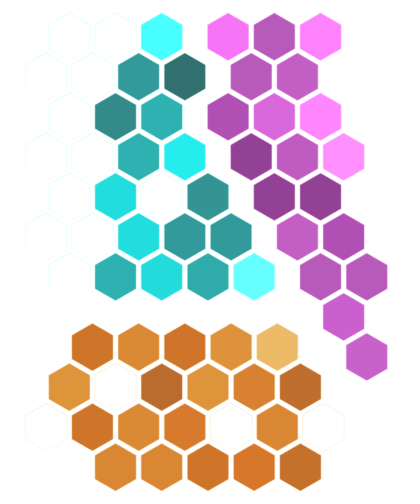

# Digital Soul

## What is Digital Soul?

Digital Soul is the most important entity that constitutes the Parmeus ecosystem. It is similar to an account in a platform in the Web 2 world; but in Parmeus, a Digital Soul is an individual created, nurtured, grown, owned and shared by the user. All Digital Soul related information is independently and securely stored in their own decentralized storage space.

In the Parmeus ecosystem, each Digital Soul is like a human being in the world we live in, with different traits, preferences, and life experiences. Users can play mini-games here, simulate their own life experiences, and share personal preferences. Every decision, every sharing, and every action you make in Parmeus will be carefully processed by Parmeus' powerful machine learning, from which the user's underlying capabilities are extracted and attached to Digital Soul. Let each user seamlessly make their Digital Soul more and more like themselves in the process of playing, and then be able to behave like me, make decision like me and recommend things more suitable for my taste, etc.

## How Digital Soul is Composed?

Digital Soul is mainly composed of two parts: `Profile Gem` and `Life Data`. In addition to this, Digital Sou has some other components, which we can introduce later.

### Profile Gem

After more than 10 years of experience accumulation, our behavioral scientists team has designed a model system which can efficiently learn a person's different performance in more than 70 dimensions  from different methods, channels, and data sources, thereby abstracting out of the ability in personality, soft skills and perference; to provide user a digital partner who can think and make decisions like you in daily life,.

Profile Gem is the underlying dimension representation after calculation. We call it "Gem" for two main reasons:

- The clarity and brightness of the gemstone are two important factors that reflect its value. Mapped to the underlying trait ability, the higher the clarity, the more stable the performance of the user's single trait; the high brightness reflects the better performance of this single trait.
- With the gradual enrichment of the Parmeus ecosystem, we will discover more underlying capabilities belonging to digital soul. Every underlying capability is the user's own wealth, just like a gem.

Therefore, in terms of appearance design, we also hope that our Digital Soul can be displayed in front of users like a case of gemstones.

### Life Data

A digital soul with only low-level abilities is incomplete. Just like a superman with a body of steel who has no deeds, it is difficult to be called a "hero". So the second core component of our Digital Soul is life data. Users can enrich their life data through our mini games, authorizing community access, binding on-chain addresses, and sharing life fragments. On the one hand, we can extract useful data to enrich and strengthen the Profile Gem; on the other hand, with the permission of users, life data can be shared with the community to help more people, so as to achieve the purpose of share to earn.
