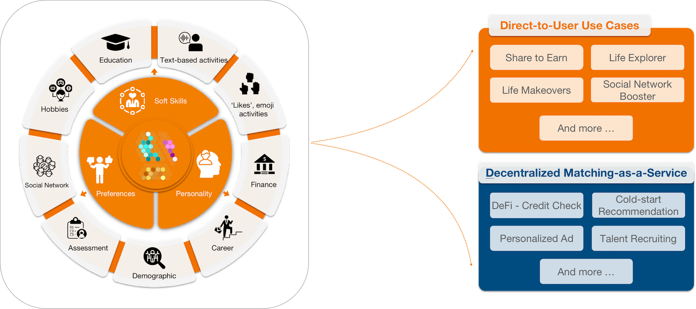

# Digital Soul

## What is a Digital Soul?

A Digital Soul is the core component of the Parmeus ecosystem. It is linked to a web3 wallet address, and is similar to an account in a platform in the Web 2 world but, in Parmeus, a Digital Soul is an individual created, nurtured, grown, owned and shared by the user. Soulbound tokens are collected by the digital soul to represent achievements, characteristics, traits and unique information. All information related to a Digital Soul will be stored anonymously using secure and robust decentralized storage using IPFS.

In the Parmeus ecosystem, each Digital Soul is connected with a human being in the real world, with different traits, preferences, and life experiences. Users can play mini-games, simulate their own life experiences, and share personal preferences. Every decision, every shared experience, and every action you take in Parmeus will be securely processed by Parmeus' powerful machine learning. 

Each user’s Digital Soul develops to reflect their digital behavior. Soulbound token NFTs are linked to the Digital Soul to represent interests, characteristics, traits and other attributes that contribute to a fuller picture of the user. Each user develops their Digital Soul themselves in the process of playing games, connecting and collaborating with other souls, and participating in the network. This enables the network to connect each user with other activities to further develop their Digital Soul, or with other like minded Souls.

## What makes a Digital Soul?

A Digital Soul is composed of two parts: Profile Gems and Life Data. We are planning to introduce other components in the future.

### Profile Gem

Our team of behavioral scientists have decades of experience researching and measuring individual differences, traits and performance. They have designed a model which can efficiently assess a person's performance in more than 70 dimensions through different methods, channels, and data sources. By reflecting their personality traits, soft skills and preferences, we can provide the user with connections that share similar traits, skills and preferences.

A Profile Gem is the visual representation of the underlying trait calculation. There are two key metrics represented by the Profile Gems:

- Clarity represents the underlying stability of a trait. Higher clarity represented more stable or consistent performance
- Brightness represents the strength of the underlying trait or attribute. Brighter gems represent higher, or better, performance

With the gradual enrichment of the Parmeus ecosystem, we will implement more underlying capabilities for the Digital Soul. Every underlying capability is the user's own wealth, just like a gem. 

That’s why the full Digital Soul is displayed for users like a case of gemstones.

### Life Data

A Digital Soul takes time to develop. Bringing both on-chain data from web3 activity and integrating data from a user’s past web2 activity can build up a user’s Digital Soul. 

The second core component of the Digital Soul is life data. Users can enrich their life data through our mini games, authorizing community access, binding on-chain addresses, and sharing life fragments. On the one hand, we can extract useful data to enrich and strengthen the Profile Gem; on the other hand, with the permission of users, life data can be shared with the community to help more people. Users can earn compensation from sharing their own data with the network. 

## What Can a Digital Soul Do?

* _For the digital soul owner_, the digital soul can be like a digital companion who knows you, thinks like you, decides like you, acts like you, understands your preferences, and accompanies you every day.
- _For individual users_ of the Parmeus ecosystem, you can specify conditions to quickly, simply and efficiently find people similar to you in terms of preferences, skills or personality; and get some meaningful suggestions and ideas from them. Inspired.
- _For projects_ that use the Parmeus ecosystem, they can search for qualified digital souls and provide suitable recommendations and airdrops in various fields.
- _For developers_, through Parmeus SDK or RESTful API, with the authorization of the owner of digital soul, customized query, recommendation, authentication and peripheral functions can be realized. 

