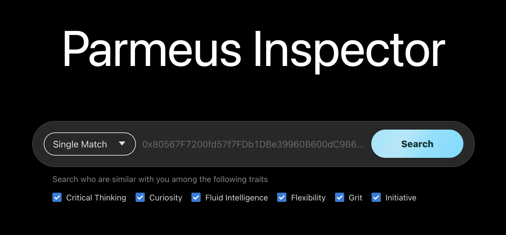
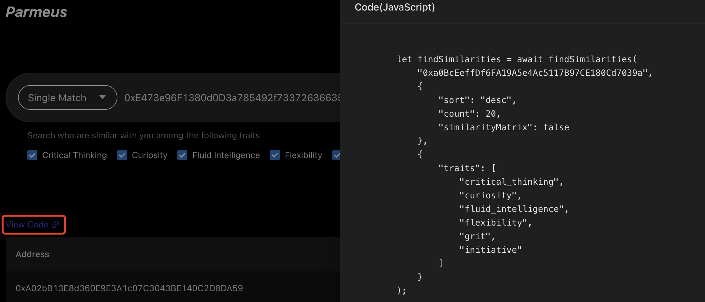
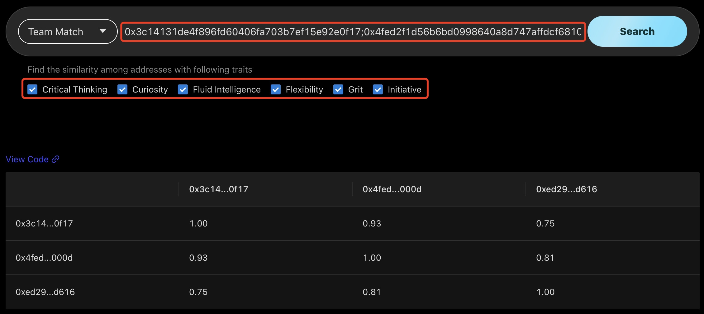
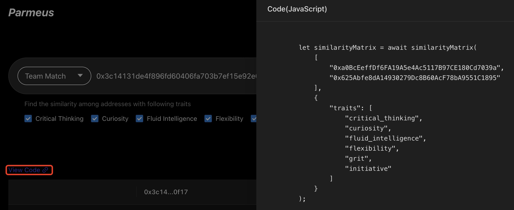
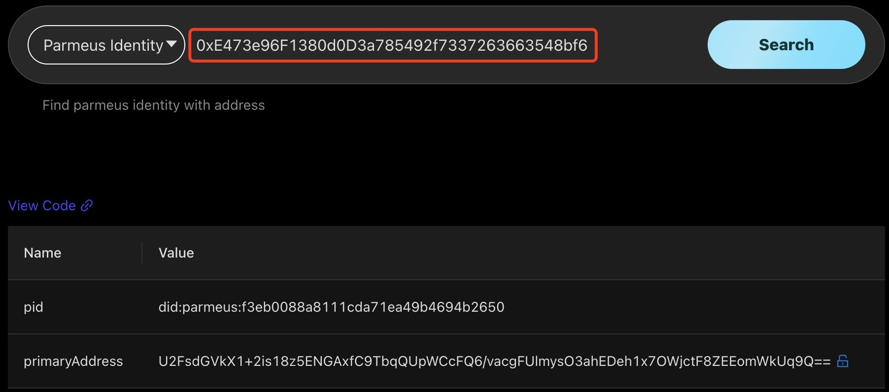
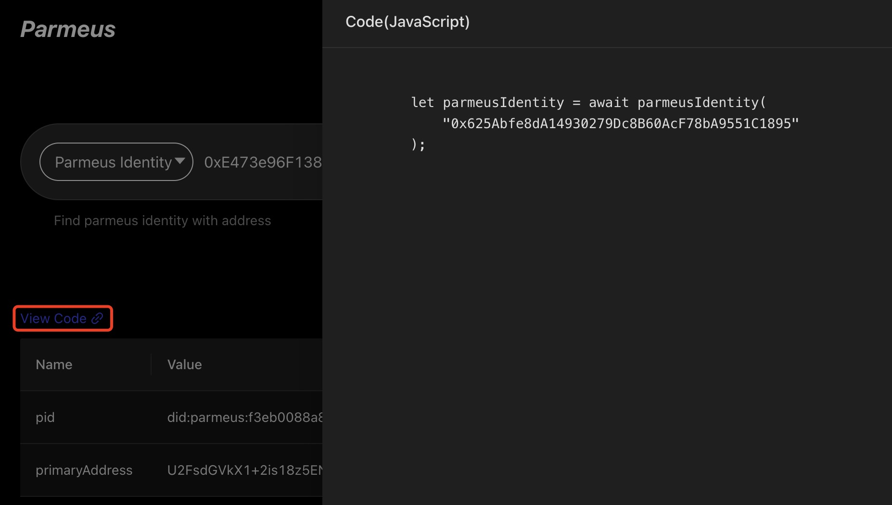
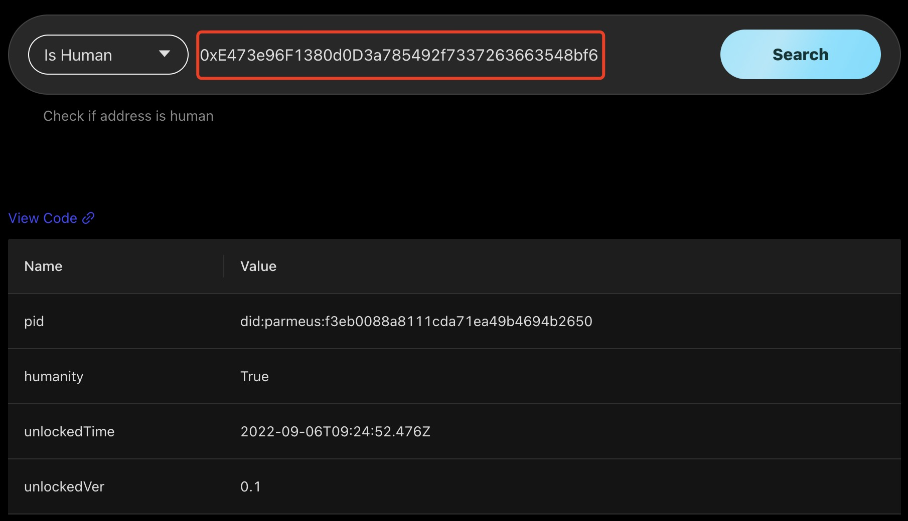
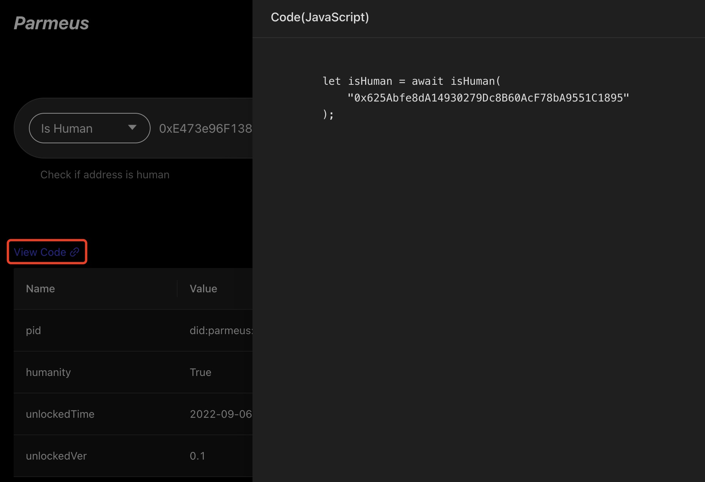

# Parmeus Inspector

Parmeus provides an [inspector](https://parmeus.github.io/explorer) for users to try APIs conveniently and intuitively. Users can select a function in the drop down list. It currently supports 4 functions:
* Single Match: To find similar digitalSouls based on specified digitalSoul.
* Team Match: To get the similarity matrix of a set of DigitalSouls.
* Parmeus Identity: To get Parmeus identification including pid (ParmeusID), and primaryAddress.
* Is Human: To validate whether a user is Human.

## Single Match

Single Match provides the function to find Digital Souls which are similar to a specific Digital Soul. Please refer to [Recommendation of Similarities API](guide/reference/restful?id=recommendation-of-similarities) for specification of the API.

The following steps are required to perform a search:
* Input wallet address
* Configure which traits are used to filter based on similarity

In the results, the user can find digitalSouls with similarities to the specified digitalSoul.

The user can check the source code of the request by clicking the View Code link.

## Team Match

Team Match provides function to get the similarity matrix about a set of DigitalSouls. Please refer to [Get Similarity Matrix of DigitalSouls API](guide/reference/restful?id=get-similarity-matrix-of-digitalsouls) for details.

The following steps are required to perform a search:
* Input a series of wallet addresses, separated by semicolons (;)
* Configure which traits are used to filter for similarity

In the results, the user can see the orthogonal matrix of similarity between the specified Digital Souls. The matrix shows the similarity of each Digital Soul to others.

The user can check the source code of the request by clicking the View Code link.

## Parmeus Identity

Parmeus Identity provides functionality to obtain Parmeus Identification of a specific wallet address, including pid (ParmeusID) and primaryAddress. Please refer to [Get Parmeus Identity API](guide/reference/restful?id=get-parmeus-identity) for specification of the API.

The user can input a wallet address to perform a search. The result will be shown below, including:
* pid: The parmeus id of the address
* primaryAddress: The wallet address (in encrypted format) that works as the primary address of the Digital Soul. The user can click the unlock button to check the decrypted address.

The user can check the source code of the request by clicking the View Code link.

## Is Human

Is Human provides functionality to assess whether a specific wallet address is human, by checking the Humanity Soulbound token of the user. Please refer to [Validate Badge of User API](guide/reference/restful?id=validate-badge-of-user) for specification of the API.

The user can input a wallet address to perform a search. The result will be shown below, including:
* pid: The parmeus id of the address
* humanity: If the user is human (have the humanity SoulBoundToken)
* unlockedTime: The time when the user get the token.
* unlockedVer: Unlocked version of the token.

The user can check the source code of the request by clicking the View Code link.

