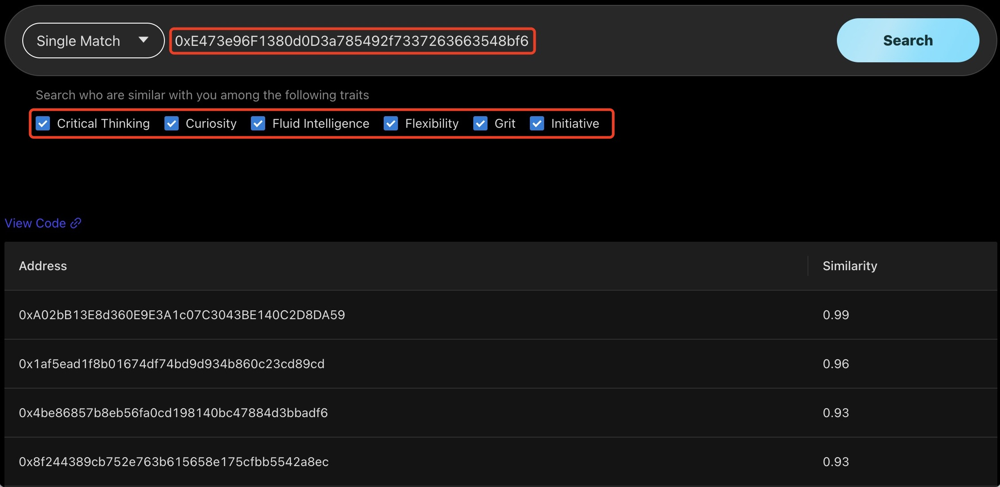

# Explorer

Parmeus provides a [explorer](https://parmeus.github.io/explorer) for user to try APIs conveniently and intuitively. User could select function in the drop down list. It supports 4 functions now:
* Single Match: To find some similar digitalSouls of specific digitalSoul.
* Team Match: To get the similarity matrix about a set of DigitalSouls.
* Parmeus Identity: To get Parmeus identification including pid (ParmeusID), and primaryAddress.
* Is Human: To validate whether a user is Human.

## Single Match

Single Match provide the function to find similar digitalSouls of specific digitalSoul. Please refer to [Recommendation of Similarities API](guide/reference/restful?id=recommendation-of-similarities) for specification of the API.

User shall do the following steps to make the search
* Input wallet address
* Configure traits filter which are used as similar criteria

In the result, user could found some similar digitalSouls with their similarities to the requested one.

User could check the source code of the request by click the `View Code` link.

## Team Match

Team Match provides function to get the similarity matrix about a set of DigitalSouls. Please refer to [Get Similarity Matrix of DigitalSouls API](guide/reference/restful?id=get-similarity-matrix-of-digitalsouls) for specification of the API.

User could do the following steps to make the search
* Input series of wallet address separated by `;`
* Configure traits filter which are used as similar criteria

In the result, user could check the orthogonal matrix about similarity of all digitalSouls. The matrix represents the similarity of each digitalSoul to others.

User could check the source code of the request by click the `View Code` link.

## Parmeus Identity

Parmeus Identity provide function to get Parmeus Identification of specific wallet address including pid (ParmeusID), and primaryAddress. Please refer to [Get Parmeus Identity API](guide/reference/restful?id=get-parmeus-identity) for specification of the API.

User could input the wallet address and make the search. The result will be shown below including:
* pid: The parmeus id of the address
* primaryAddress: The wallet address (in encypted format) that works as primary address of the digitalSoul. User could click the unlock button to check decrypted address.

User could check the source code of the request by click the `View Code` link.

## Is Human

Is Human provide function to validate if specific wallet address is human (through checking humanity SoulBoundToken of the user). Please refer to [Validate Badge of User API](guide/reference/restful?id=validate-badge-of-user) for specification of the API.

User could input the wallet address and make the search. The result will be shown below including:
* pid: The parmeus id of the address
* humanity: If the user is human (have the humanity SoulBoundToken)
* unlockedTime: The time when the user get the token.
* unlockedVer: Unlocked version of the token.

User could check the source code of the request by click the `View Code` link.

