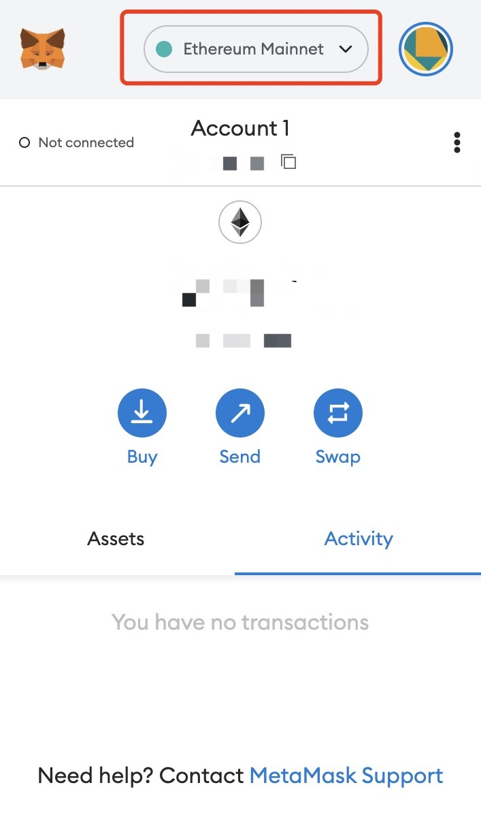
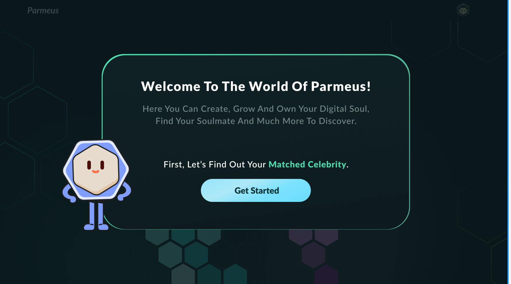
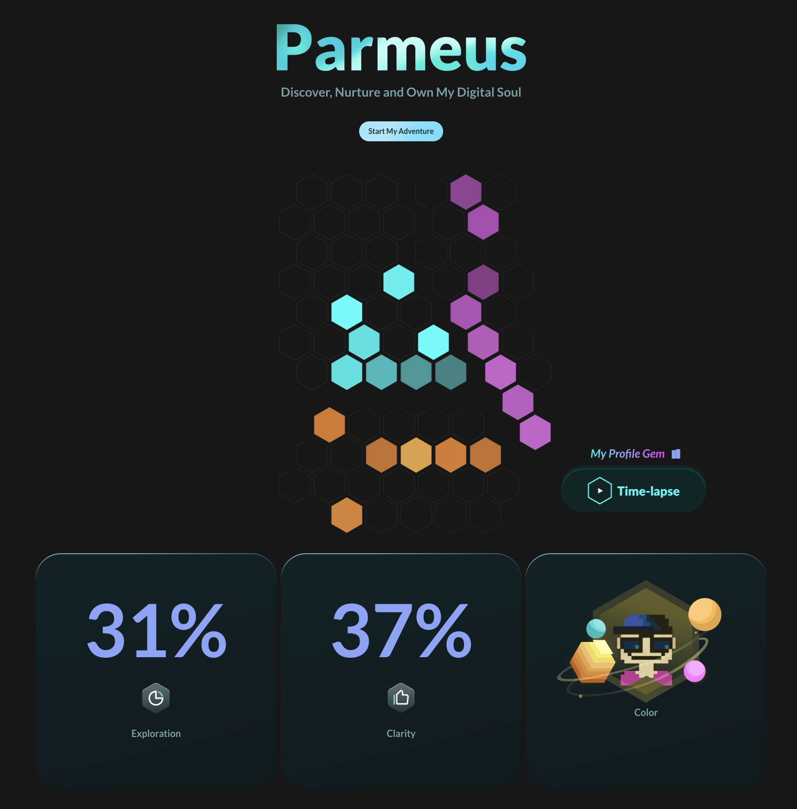
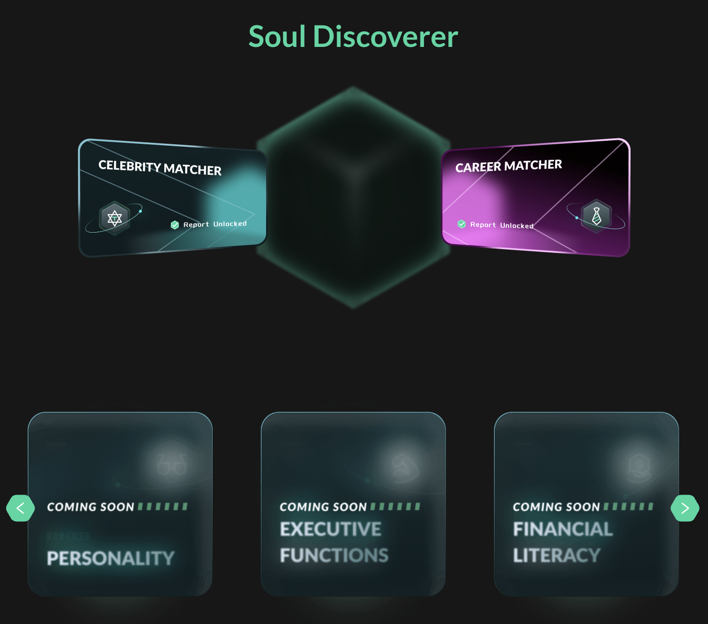
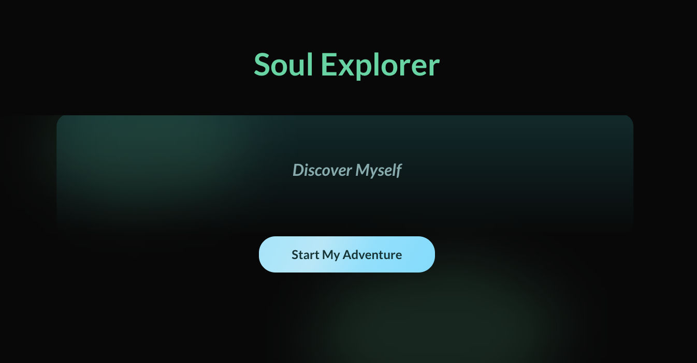
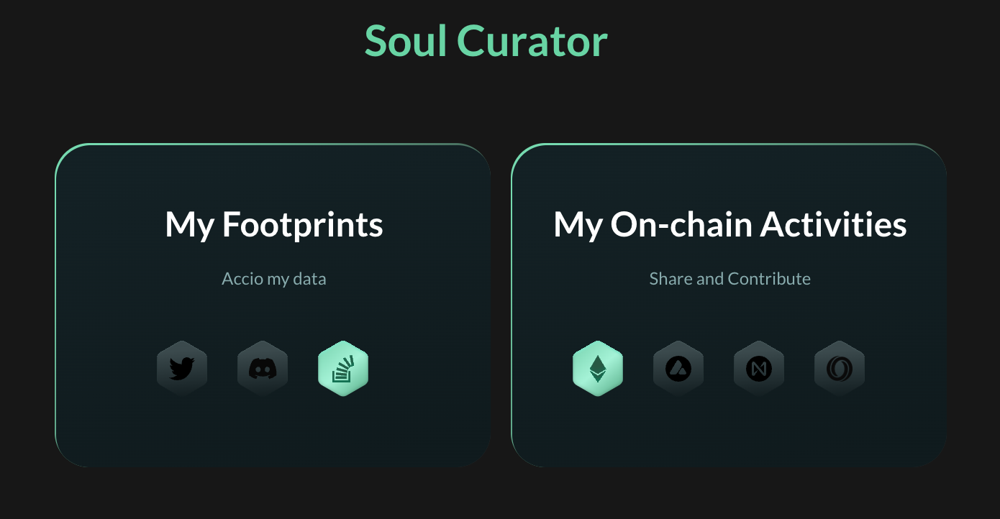
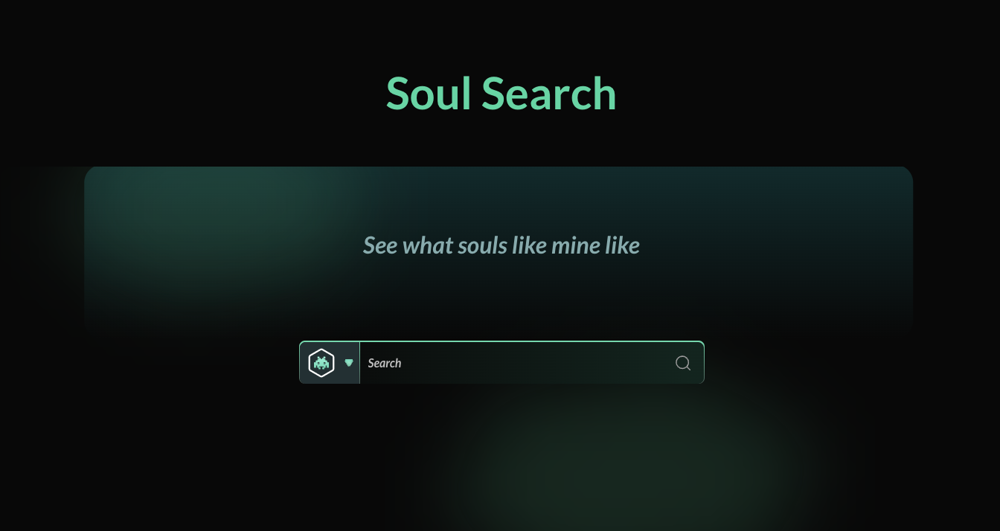

# End-User Guide

Parmeus provides a built-in game world which allows users to create and develop their Digital Souls. Please follow this step-by-step instruction to kick-off this Digital Soul building journey.

## Setup a Wallet
To enter the web3 world, you need a wallet. `MetaMask` is the most popular digital wallet specific to Ethereum. Parmeus supports a few other wallets as well, and more to come.

In this guide, we will use MetaMask as an example to show you how to set up a wallet.

* Download and install the [MetaMask browser extension](https://metamask.io/download/) through their website.
* Select `Create a Wallet`.
* Provide a username and password, and store them securely.
* Pay close attention to your uniquely assigned Secret Recovery Phrase, and store it somewhere safe. If you lose this series of words or forget what order they’re in, you will lose access to your wallet and it will be unrecoverable. We recommend writing the phrase in a secret notebook.
* Confirm the phrase by placing all of the words in the correct order as they were assigned.
* Now, MetaMask is setup and should appear in your browser extensions.

## Switch Network in Wallet

Parmeus supports Ethereum only currently. Make sure the active network is `Ethereum Mainnet`. You can switch networks by opening MetaMask and clicking at the top of the MetaMask extension. You'll see your current network displayed, click on it and you can select any network from the drop-down list.

## Start Digital Soul Jouney

You can either enter the Parmeus dApp by landing page (https://parmeus.com) or directly enter by (https://parmeus.com/app).

### Connect to Wallet

The interface guides you to connect to your current wallet. If you don't have a Parmeus account, it will automatically create one.

### Parmeus DApp

Welcome to the Parmeus dApp POC version (a more advanced and immersive UI is in development, watch this space).

When you enter Parmeus for the first time, a warmup games help familiarize you with the interface and provide some initial data to connect with your digital ID.

#### Warmup Game - Celebrity Matcher

This is a game pack to find out the celebrities you match in the world. By playing a few minutes games, we'll learn your preferences, strategies, and thoughts, and compare them to our celebrity library to match you with the most similar celebrities. For instance if *Oprah Winfrey* is your matched celebrity, you could mint this report as NFT. 

#### Parmeus DApp Browsing

Once you unlock the `Celebrity Matcher`, all Parmeus functions are unlocked.

##### Profile Gem

For the first section, you will find your profile gem.  As you train your digital soul, more and more gems will be lit up, which is also one of your personal treasures.

Here we introduce some Parmeus terminology.

1. *Exploration* is your profile gem lit up cover rate.
1. *Clarity* is how stable your profile gem is, the more training, the more stable.
1. *Color* is your avatar generated based on your digital soul.

##### Soul Discoverer

In this section, we provide our well-designed game packs, and we collect your behaviors on the premise of simply satisfying the fun, and give you some advice in terms of workplace, psychology, finance, etc. More game packs are on the way.

##### Soul Explorer

**This is still in beta now, and will be available soon.** In this part, we will provide various mini-games to learn about you traits, preferences abilities and interests in topics like music, film and television. The Soul Explorer helps to develops your own Digital Soul quickly.

##### Soul Curator

**This is still in beta now, and will be available soon.** In this section, Parmeus will follow your authorization to access your social community. After our AI processes the data from your social network, Parmeus continuously develops your digital soul, making it more stable and powerful. In the meantime, your social data is also properly and safely kept in your decentralized storage space.

##### Soul Search

In this section, Parmeus offers different searches to find what your soulmate likes. Initially, the search results may be inaccurate, and it will improve as your digital soul grows stronger and other digital souls contribute.

## Concluding Remarks
This dApp represents a number of functional tools to help users quickly build a digital soul, as well as a small demo to demonstrate its capabilities. But it's still in very early stages. Our vision is to provide you with a more immersive gaming experience and more of the benefits your digital soul brings to your daily life and your social networks.

