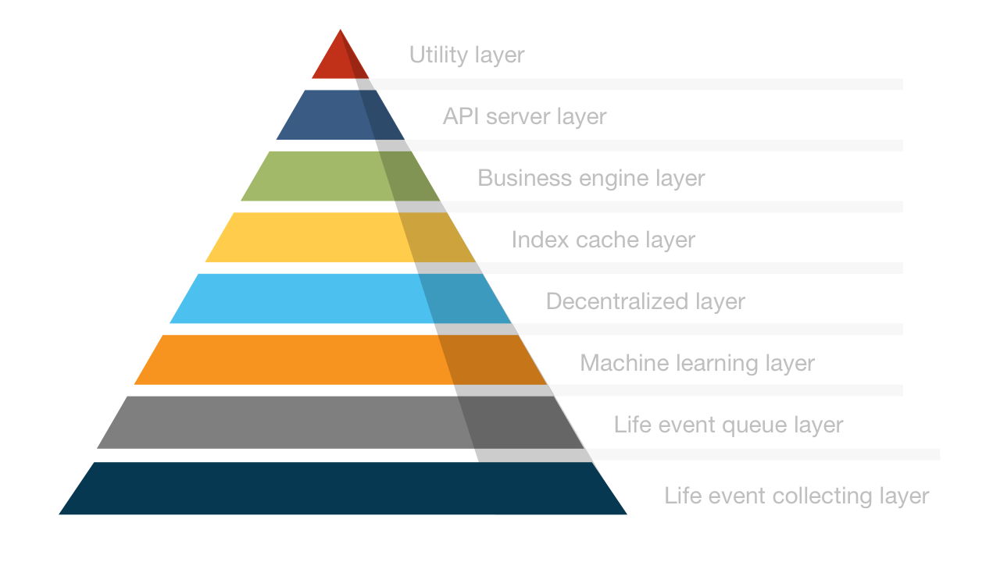

# Tech Stack

The core of Parmeus is an ecosystem built on the basis of digital soul. In the ecosystem, users can build, cultivate, train, and own their unique digital souls; in the ecosystem formed by digital souls, each digital soul is growing, connecting, and sharing its own personality, preferences, and skills. In order to build this whole ecology, here is a brief introduction to our technical architecture model.

This is an overview of Parmeus technical stack.

## Life event collecting layer

Parmeus digital soul is gradually constructed by collecting and analyzing users' life data. Life data is again composed of user activity events. Therefore, recording the user's behavior in the Parmeus platform is crucial to building digital soul. We have designed various modules to obtain data from various aspects.

1. **Web 2 curator** automatically collects current status data within the scope of user authorized access within existing popular social platforms.
2. **Web 3 curator** automatically collects on-chain data within the scope of user authorized access within popular block-chains.
3. **Parmeus life explorer**, through life simulators, mini-games, and questionnaires, discover abilities you didn't know you had.
4. **Parmeus SDK** allows developers to inject life fragment events into system and form life data for digital soul.

## Life event queue layer
In this layer, we push the collected raw events to the event message queue for training and filtering after consumption by the upper-layer service. Through the queue layer, the processing efficiency and scale of the Parmeus streaming system are greatly improved.

## Parmeus machine learning layer
As the consumer of raw event messages, ML layer sets up a set of distributed computing services to clean, transform and normalize rough raw event data. The processed data is split into two different paths to train digital soul. One side is used as the training data of the underlying capabilities; the other side is used as a life fragment, which is filled with life data that users can share and earn from the community.

## Parmeus decentralized layer
This layer is the Parmeus decentralized processing layer. In this layer, Parmeus stores the relevant information of digital soul, including profile gem and life data in a decentralized storage medium, and returns valuable data to users. At the same time, Parmeus will also mint PSBTs that reflect digital soul's growth milestone and capabilities through smart contracts.

## Parmeus index cache layer
Digital soul's profile gem and life data both have very complex data structures. In order to meet search conditions at various levels and efficient return speed, Parmeus has set up this centralized cache database layer.

## Parmeus business engine layer
In order to support various upper-level business applications, Parmeus has built a set of extensible frameworks to provide corresponding upper-level algorithm models for matching, authentication, and recommendation etc.

## Parmeus API server
The API server encapsulates the business model algorithm into a RESTful API that the front-end and back-end code can directly call.

## Parmeus utility layer
Utility layer encapsulates all open APIs, security verification functions and commonly used toolkits into an easy-to-use SDK for developers to easily integrate into their own decentralized applications.